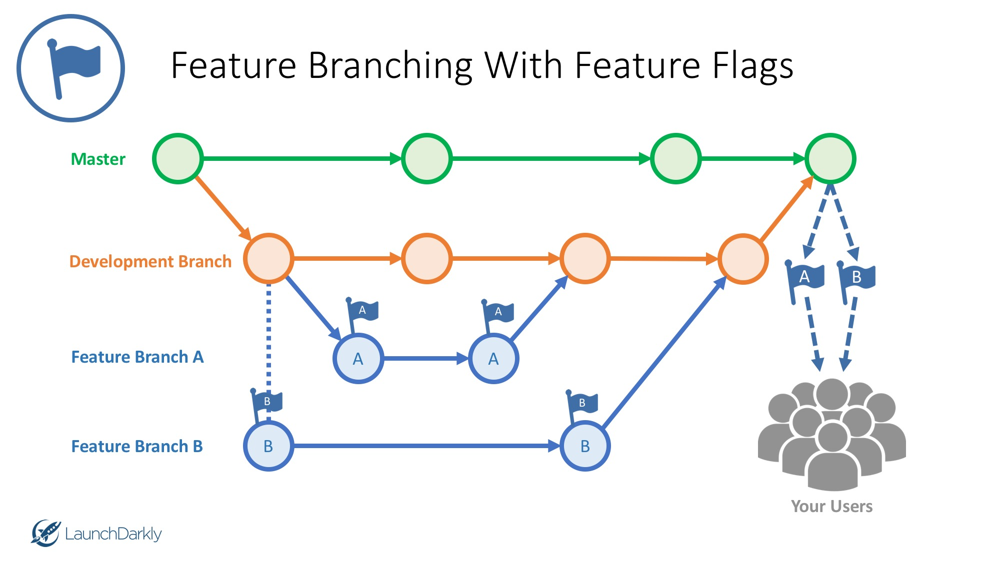

# LaLiga

## La Liga Del Caballero Ordinario
The League of Ordinary Gentlemen

## Purpose

This is our Fantasy Football League Website. This site is made for fun to practice our development skills, a full stack node application where we display league news, stats, trash talk, random league facts, meetups, photos and more. This is a constant work in progress as we are moonlighting this webapp. Enjoy!

Visit the La Liga website at  [laligadelcaballeroordinario.com](http://www.laligadelcaballeroordinario.com/)

## Application Structure
    .
    ├── build                                             # build folder is generated when gulp tasks run
    │   ├── css                                           # built css folder
    │   │   ├── styles.min.css                            # concatenated and minified css build (the css file used in our app)
    │   │   └── styles.min.css.map                        # minified css source map to map styles to correct stylesheets in console for easier debugging purposes
    │   └── js                                            # built js folder
    │       ├── app.js                                    # concatenated js build
    │       ├── app.min.js                                # concatenated and minified js build (the client side js used in our app)
    │       └── app.min.js.map                            # minified js source map to map back to correct file in the browser for easier debugging purposes
    ├── config                                            # config folder holds passport configuration
    │   └── passport.js                                   # passport user authentication middleware
    ├── controllers                                       # controllers folder holds application routes
    │   ├── api-routes.js                                 # routes for all our own api calls
    │   ├── auth-routes.js                                # routes for authenticated users
    │   └── html-routes.js                                # routes for all users
    ├── gulp-tasks                                        # gulp-tasks folder holds gulp serve file
    │   └── serve.js                                      # serve.js preforms scss and js concatenation and minification (converts scss to css and concats and minfies css and client js files and creates build folder and files)
    ├── models                                            # models folder holds our data models
    │   ├── User.js                                       # user model
    │   └── index.js                                      # export all models to be used throughout the app
    ├── public                                            # public folder holds images/client js/scss
    │   └── assets
    │       ├── images                                    # all images live here
    │       ├── js                                        # client side js folder
    │       │   ├── analytics                             # client side analytics scripts
    │       │   │   ├── digitalData.js
    │       │   │   └── digitalDataHelperFunctions.js
    │       │   ├── custom                                # client side custom js scripts
    │       │   │   ├── main.js
    │       │   │   └── modular-example.js
    │       │   ├── mobile-menu                           # client side mobile menu
    │       │   │   └── event-handlers.js
    │       │   └── template                              # client side js for website template
    │       │       ├── core.js
    │       │       ├── init.js
    │       │       └── jpreloader.js
    │       └── scss                                      # scss folder
    │           ├── partials                              # scss partials, partials are indicated with _
    │           │   ├── _404.scss                         # 404 not found page styles
    │           │   ├── _classes.scss                     # generic classes used across app
    │           │   ├── _default.scss                     # default styles used across app (provided from template)
    │           │   ├── _template.scss                    # template styles used across app (provided from template)
    │           │   └── _variables.scss                   # variables used across app
    │           └── styles.scss                           # read all partials into styles.scss
    ├── test                                              # unit tests
    │   ├── app.js
    │   └── models.js
    ├── views                                             # handlebar views
    │   ├── account                                       # account page views
    │   │   ├── forgot.handlebars
    │   │   ├── login.handlebars
    │   │   ├── profile.handlebars
    │   │   ├── reset.handlebars
    │   │   └── signup.handlebars
    │   ├── helpers                                       # handlebar helper functions
    │   │   └── momentFromTimeNow.js
    │   ├── layouts                                       # handlebar main template needed for file structure format
    │   │   └── main.handlebars
    │   ├── partials                                      # handlebar partials
    │   │   ├── footer.handlebars                         # handlebar footer template
    │   │   ├── header.handlebars                         # handlebar header template
    │   │   └── nav.handlebars                            # handlebar navigation template
    │   ├── 404.handlebars                                # handlebar 404 page
    │   └── index.handlebars                              # handlebar index page
    ├── .editorconfig                                     # editorconfig helps developers define and maintain consistent coding styles between different editors and IDEs
    ├── .eslintignore                                     # eslint ignores these folders/files
    ├── .eslintrc.js                                      # eslint to find errors in code prior to pushing branches
    ├── .gitignore                                        # specified intentionally untracked files to ignore
    ├── README.md                                         # this page
    ├── gulpfile.js                                       # gulpfile.js needed for gulp tasks
    ├── package.json                                      # specifics of npm packages and application
    └── server.js                                         # kickoff the app

Get up with Jason Schmitt if you want to know the environment variables for the ignored .env file - functionality will not work for api keys and secret creds without those.


## Tech Used

<b>Built with</b>
- [Node.js](https://nodejs.org/en/)
- [Mongo](https://www.npmjs.com/package/connect-mongo)
- [Express.js](https://www.npmjs.com/package/express)
- [Handlebars.js](https://www.npmjs.com/package/express-handlebars)
- [Lodash](https://lodash.com/)
- [Moment.js](https://momentjs.com/)
- [Bootstrap](https://getbootstrap.com/docs/3.3/)
- [mlab](https://mlab.com/)
- [Passport](http://www.passportjs.org/)
- [Gulp](https://gulpjs.com/)
- [Axios](https://www.npmjs.com/package/axios)
- [Slick.js](http://kenwheeler.github.io/slick/)
- HTML5, CSS3, SCSS, Javascript, and jQuery

# Getting Started

- Fork or clone the GitHub repo to your machine.
- Ensure that you have Node.js, mongo and Gulp installed on your machine.
- In your CLI, navigate to the cloned directory. `npm install` the dependencies and run `npm start`

  `npm install`

  `npm start`

- If you need to start mongod, do so in your terminal by starting `mongod`

- Once started, you are able to view the project on `http://localhost:8080/`

- 🎉Happy developing!🎉


# Linting

Before you push your branch up to the `develop` branch, ensure you lint your code.

run `npm run lint` this will show if you have any ESLint errors or warnings.
If you have any errors, please fix them. If you have warnings that could slide, push your code up or talk with a team member.


# Development 👨‍💻

The command `npm start` or `gulp` will automatically launch the project. Navigate to `http://localhost:8080/`

The files watched by gulp are the client js and sass files.

Client side js files are located at `public/assets/js/*/*.js`. Editing these files and saving will kick off a gulp build and auto refresh your development workspace. The gulp build will generate/replace your `/build` folder with the updated minified js files.

Sass files are located at `sass/partials/*.scss`. Editing these files and saving will kick off a gulp build and auto refresh your development workspace. The gulp build will replace your `/build` folder with the updated minified css files.

If you're editing any file outside of `public/assets/js/*` or `sass/partials`, we recommend running `npm run watch`, this runs nodemon, which watches all of our files. Or if you edit any of these files, stop the server from listening and restart the server manually with `npm start` or `gulp`.


### Branching process

- Master is a 🔒protected branch🔒. This means we need at least 1 approval before we merge into our master branch. (having the master branch protected helps so we know for sure what is going into master, and noone can accidentally push code to it and break our site)
- Develop will be the branch we create branches off of. Develop will be merged into master at the end of every day.
- This screenshot 👇 illustrates this process
- Feature A and Feature B are branches where we code our tasks. Once finished with making your edits, we merge that branch into develop. At the end of everyday, develop gets merged into master.
- Then develop is updated with the latest version of master, and the process happens all over again.



### Branching process cont
```
1. Start on a clean branch

  1.1 Check which branch you're on `git branch`

  1.2 Start on develop branch, `git checkout develop`

  1.3 Do a `git pull` to get the latest copy of develop

  1.4 Create your new branch to code your story, `git checkout -b <branchname>` (Title your branch name the title of the story you're working on, replace spaces with -)

  1.5 Now you're on your own branch. Type `git branch` to see you're on your new branch

  1.6 Now write your code ✏️
2. You're done writing code, time to add your files and commit message to your branch

  2.1 Once you're code is done for the story you're working on, run `npm run -s eslint .` to see if any linting errors/warnings. fix anything that is outstanding. next we will add your changes to your branch and commit them.

  2.2 Type `git status` to see the status of the files you've worked on. (these should be red, because you havent added them yet)

  2.3 To add these files, type `git add .` to add all files

  2.4 Type `git status` again, you will now see the files are green, which indicates they have been added to your branch

  2.5 Now make your commit message that says specifically what code you changed in this story. `git commit -m "your commit message here"`
3. You're ready to push your branch up to github

  3.1 Next, push your code up to the repository, with a `git push origin <branchname>`

  3.2 Once your branch is pushed up, navigate to our repo, and you can see branch under "Your recently pushed branches:". Click on Compare & pull request

  3.3 ❗Choose the base branch `development` as that will be the branch that you merge your branch into. (the development branch will be merged into master daily TODO: determine when we want builds to master branch to happen ❓)

  3.4 On the right hand side, add reviewers to review your pull request. Then click "Create Pull Request"

  3.5 Once your pull request is approved and merged, it will be 🙌built out into master🙌 during the next build to production. (TODO: determine when we want builds to maste branch to happen ❓)
```


### Find a bug or want to add an issue? 🕵️

- Document what the issue is, if you can find the root problem, write whatever you have down
- Go to the Issues tab, create a new issue
- Assign it to yourself if you want to work on that issue, or leave it blank and someone else can assign themselves to it if they want to take on the challenge
- Add a label to it. Most are going to be bugs or enhancement
- [See bucky talk about this in more detail](https://www.youtube.com/watch?v=YshvUGgF_3o)


editorconfig

https://editorconfig.org/ view editor config documentation and if your text editor needs a plugin installed for editorconfig to work as expected.


## Table of Contents

  1. [Types](#types)
  1. [References](#references)
  1. [Objects](#objects)
  1. [Arrays](#arrays)
  1. [Destructuring](#destructuring)
  1. [Strings](#strings)
  1. [Functions](#functions)
  1. [Arrow Functions](#arrow-functions)
  1. [Classes & Constructors](#classes--constructors)
  1. [Modules](#modules)
  1. [Iterators and Generators](#iterators-and-generators)
  1. [Properties](#properties)
  1. [Variables](#variables)
  1. [Hoisting](#hoisting)
  1. [Comparison Operators & Equality](#comparison-operators--equality)
  1. [Blocks](#blocks)
  1. [Control Statements](#control-statements)
  1. [Comments](#comments)
  1. [Whitespace](#whitespace)
  1. [Commas](#commas)
  1. [Semicolons](#semicolons)
  1. [Type Casting & Coercion](#type-casting--coercion)
  1. [Naming Conventions](#naming-conventions)
  1. [Accessors](#accessors)
  1. [Events](#events)
  1. [jQuery](#jquery)
  1. [ECMAScript 5 Compatibility](#ecmascript-5-compatibility)
  1. [ECMAScript 6+ (ES 2015+) Styles](#ecmascript-6-es-2015-styles)
  1. [Standard Library](#standard-library)
  1. [Testing](#testing)
  1. [Performance](#performance)
  1. [Resources](#resources)
  1. [In the Wild](#in-the-wild)
  1. [Translation](#translation)
  1. [The JavaScript Style Guide Guide](#the-javascript-style-guide-guide)
  1. [Chat With Us About JavaScript](#chat-with-us-about-javascript)
  1. [Contributors](#contributors)
  1. [License](#license)
  1. [Amendments](#amendments)


eslint rules (styleguide)

## References

  <a name="references--prefer-const"></a><a name="2.1"></a>
  - [2.1](#references--prefer-const) Use `const` for all of your references; avoid using `var`. eslint: [`prefer-const`](https://eslint.org/docs/rules/prefer-const.html), [`no-const-assign`](https://eslint.org/docs/rules/no-const-assign.html)

    > Why? This ensures that you can’t reassign your references, which can lead to bugs and difficult to comprehend code.

    ```javascript
    // bad
    var a = 1;
    var b = 2;

    // good
    const a = 1;
    const b = 2;
    ```

  <a name="references--disallow-var"></a><a name="2.2"></a>
  - [2.2](#references--disallow-var) If you must reassign references, use `let` instead of `var`. eslint: [`no-var`](https://eslint.org/docs/rules/no-var.html)

    > Why? `let` is block-scoped rather than function-scoped like `var`.

    ```javascript
    // bad
    var count = 1;
    if (true) {
      count += 1;
    }

    // good, use the let.
    let count = 1;
    if (true) {
      count += 1;
    }
    ```

  <a name="references--block-scope"></a><a name="2.3"></a>
  - [2.3](#references--block-scope) Note that both `let` and `const` are block-scoped.

    ```javascript
    // const and let only exist in the blocks they are defined in.
    {
      let a = 1;
      const b = 1;
    }
    console.log(a); // ReferenceError
    console.log(b); // ReferenceError
    ```

**[⬆ back to top](#table-of-contents)**

<a name="whitespace--around-keywords"></a><a name="18.3"></a>
  - [19.3](#whitespace--around-keywords) Place 1 space before the opening parenthesis in control statements (`if`, `while` etc.). Place no space between the argument list and the function name in function calls and declarations. eslint: [`keyword-spacing`](https://eslint.org/docs/rules/keyword-spacing.html)

    ```javascript
    // bad
    if(isJedi) {
      fight ();
    }

    // good
    if (isJedi) {
      fight();
    }

    // bad
    function fight () {
      console.log ('Swooosh!');
    }

    // good
    function fight() {
      console.log('Swooosh!');
    }
    ```

a name="whitespace--infix-ops"></a><a name="18.4"></a>
  - [19.4](#whitespace--infix-ops) Set off operators with spaces. eslint: [`space-infix-ops`](https://eslint.org/docs/rules/space-infix-ops.html)

    ```javascript
    // bad
    const x=y+5;

    // good
    const x = y + 5;
    ```

<a name="whitespace--padded-blocks"></a><a name="18.8"></a>
  - [19.8](#whitespace--padded-blocks) Do not pad your blocks with blank lines. eslint: [`padded-blocks`](https://eslint.org/docs/rules/padded-blocks.html)

    ```javascript
    // bad
    function bar() {

      console.log(foo);

    }

    // bad
    if (baz) {

      console.log(qux);
    } else {
      console.log(foo);

    }

    // bad
    class Foo {

      constructor(bar) {
        this.bar = bar;
      }
    }

    // good
    function bar() {
      console.log(foo);
    }

    // good
    if (baz) {
      console.log(qux);
    } else {
      console.log(foo);
    }
    ```

<a name="whitespace--in-brackets"></a><a name="18.10"></a>
  - [19.10](#whitespace--in-brackets) Do not add spaces inside brackets. eslint: [`array-bracket-spacing`](https://eslint.org/docs/rules/array-bracket-spacing.html)

    ```javascript
    // bad
    const foo = [ 1, 2, 3 ];
    console.log(foo[ 0 ]);

    // good
    const foo = [1, 2, 3];
    console.log(foo[0]);
    ```

<a name="whitespace--in-braces"></a><a name="18.11"></a>
  - [19.11](#whitespace--in-braces) Add spaces inside curly braces. eslint: [`object-curly-spacing`](https://eslint.org/docs/rules/object-curly-spacing.html)

    ```javascript
    // bad
    const foo = {clark: 'kent'};

    // good
    const foo = { clark: 'kent' };
    ```

<a name="whitespace--no-multiple-empty-lines"></a>
  - [19.19](#whitespace--no-multiple-empty-lines) Avoid multiple empty lines and only allow one newline at the end of files. eslint: [`no-multiple-empty-lines`](https://eslint.org/docs/rules/no-multiple-empty-lines)

    <!-- markdownlint-disable MD012 -->
    ```javascript
    // bad
    var x = 1;


    var y = 2;

    // good
    var x = 1;

    var y = 2;
    ```

## Commas

  <a name="commas--leading-trailing"></a><a name="19.1"></a>
  - [20.1](#commas--leading-trailing) Leading commas: **Nope.** eslint: [`comma-style`](https://eslint.org/docs/rules/comma-style.html)

    ```javascript
    // bad
    const story = [
        once
      , upon
      , aTime
    ];

    // good
    const story = [
      once,
      upon,
      aTime,
    ];

    // bad
    const hero = {
        firstName: 'Ada'
      , lastName: 'Lovelace'
      , birthYear: 1815
      , superPower: 'computers'
    };

    // good
    const hero = {
      firstName: 'Ada',
      lastName: 'Lovelace',
      birthYear: 1815,
      superPower: 'computers',
    };
    ```

<a name="accessors--boolean-prefix"></a><a name="23.3"></a>
  - [24.3](#accessors--boolean-prefix) If the property/method is a `boolean`, use `isVal()` or `hasVal()`.

    ```javascript
    // bad
    if (!dragon.age()) {
      return false;
    }

    // good
    if (!dragon.hasAge()) {
      return false;
    }
    ```

## jQuery

<a name="jquery--dollar-prefix"></a><a name="25.1"></a>
  - [26.1](#jquery--dollar-prefix) Prefix jQuery object variables with a `$`.

    ```javascript
    // bad
    const sidebar = $('.sidebar');

    // good
    const $sidebar = $('.sidebar');

    // good
    const $sidebarBtn = $('.sidebar-btn');
    ```

<a name="jquery--cache"></a><a name="25.2"></a>
  - [26.2](#jquery--cache) Cache jQuery lookups.

    ```javascript
    // bad
    function setSidebar() {
      $('.sidebar').hide();

      // ...

      $('.sidebar').css({
        'background-color': 'pink',
      });
    }

    // good
    function setSidebar() {
      const $sidebar = $('.sidebar');
      $sidebar.hide();

      // ...

      $sidebar.css({
        'background-color': 'pink',
      });
    }
    ```

<a name="jquery--find"></a><a name="25.4"></a>
  - [26.4](#jquery--find) Use `find` with scoped jQuery object queries.

    ```javascript
    // bad
    $('ul', '.sidebar').hide();

    // bad
    $('.sidebar').find('ul').hide();

    // good
    $('.sidebar ul').hide();

    // good
    $('.sidebar > ul').hide();

    // good
    $sidebar.find('ul').hide();
    ```

**[⬆ back to top](#table-of-contents)**


## Objects

<a name="objects--no-new"></a><a name="3.1"></a>
  - [3.1](#objects--no-new) Use the literal syntax for object creation. eslint: [`no-new-object`](https://eslint.org/docs/rules/no-new-object.html)

    ```javascript
    // bad
    const item = new Object();

    // good
    const item = {};
    ```

## Strings

<a name="strings--quotes"></a><a name="6.1"></a>
  - [6.1](#strings--quotes) Use single quotes `''` for strings. eslint: [`quotes`](https://eslint.org/docs/rules/quotes.html)

    ```javascript
    // bad
    const name = "Capt. Janeway";

    // bad - template literals should contain interpolation or newlines
    const name = `Capt. Janeway`;

    // good
    const name = 'Capt. Janeway';
    ```

<a name="strings--line-length"></a><a name="6.2"></a>
  - [6.2](#strings--line-length) Strings that cause the line to go over 100 characters should not be written across multiple lines using string concatenation.

    > Why? Broken strings are painful to work with and make code less searchable.

    ```javascript
    // bad
    const errorMessage = 'This is a super long error that was thrown because \
    of Batman. When you stop to think about how Batman had anything to do \
    with this, you would get nowhere \
    fast.';

    // bad
    const errorMessage = 'This is a super long error that was thrown because ' +
      'of Batman. When you stop to think about how Batman had anything to do ' +
      'with this, you would get nowhere fast.';

    // good
    const errorMessage = 'This is a super long error that was thrown because of Batman. When you stop to think about how Batman had anything to do with this, you would get nowhere fast.';
    ```

## Functions

<a name="functions--declarations"></a><a name="7.1"></a>
  - [7.1](#functions--declarations) Use named function expressions instead of function declarations. eslint: [`func-style`](https://eslint.org/docs/rules/func-style)

    > Why? Function declarations are hoisted, which means that it’s easy - too easy - to reference the function before it is defined in the file. This harms readability and maintainability. If you find that a function’s definition is large or complex enough that it is interfering with understanding the rest of the file, then perhaps it’s time to extract it to its own module! Don’t forget to explicitly name the expression, regardless of whether or not the name is inferred from the containing variable (which is often the case in modern browsers or when using compilers such as Babel). This eliminates any assumptions made about the Error's call stack. ([Discussion](https://github.com/airbnb/javascript/issues/794))

    ```javascript
    // bad
    function foo() {
      // ...
    }

    // good
    const foo = function () {
      // ...
    };

    ```

<a name="functions--iife"></a><a name="7.2"></a>
  - [7.2](#functions--iife) Wrap immediately invoked function expressions outside parentheses. eslint: [`wrap-iife`](https://eslint.org/docs/rules/wrap-iife.html)

    > Why? An immediately invoked function expression is a single unit - wrapping both it, and its invocation parens, adding parens, cleanly expresses this.

    ```javascript
    // immediately-invoked function expression (IIFE)
    (function () {
      console.log('Welcome to the Internet. Please follow me.');
    })();
    ```


```
function() {}
```

```
// the Test Module is a namespaced function to what feature of the site this function powers
const Test = (function() {
  const aTestVariable = 'test!';

  // another function private to Module
  const privateFunction = function() {
    // this can log the 'aTestVariable' because it is defined outside of this Module function, but aTestVariable is kept private to this Module
    if(aTestVariable) {
      // console.log(aTestVariable);
    }
  }

  // this init function initializes the functions ran
  const init = function() {
    privateFunction();
  }

  // return the init function, assign it to init so it can be used outside of this Module as Test.init();
  return {
    init: init
  }
})(); // self invoke the Module so it can be called later

// how we call the Test Module to execute its functions
Test.init();
```

```
// quotes allow for sin
```

```
no file should be over 300 lines in length
```
